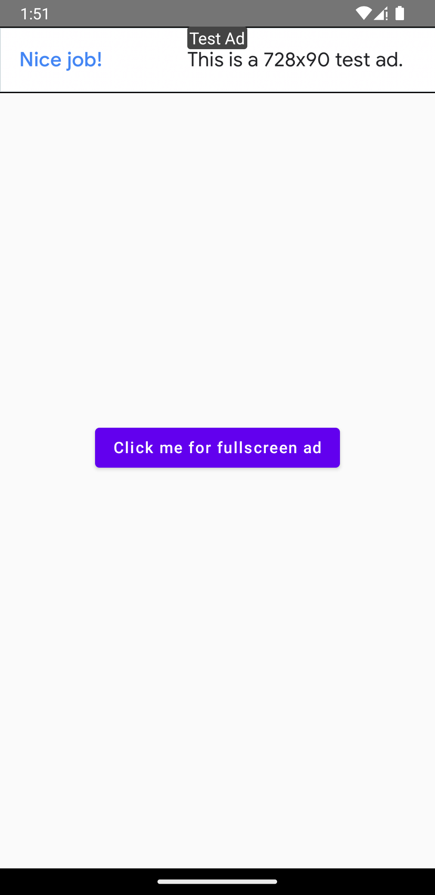
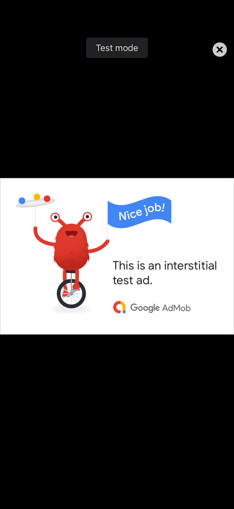

## Admob for Kotlin Multiplatform
> Admob for Kotlin Multiplatform target Android and iOS

## Dependencies
- Admob
- GoogleMobileAds (for iOS)
- Compose KMP
- SwiftUI (for iOS)

## More Details Post
[Here](https://medium.com/stackademic/admob-integration-in-compose-multiplatform-02ea5e971584)

## Demo
   Android Banner Ads | Android Interstitial Ads
:-------------------------: | :-------------------------:
 |  
  iOS Banner Ads | iOS Interstitial Ads
 |  

## Build Project
- Clone this project
- For iOS cd to iosApp directory and install cocoapods for GoogleMobileAds
```
cd iosApp
pod install --verbose
```
- run ```iosApp.xcworkspace``` instead of ```iosApp.xcodeproj```
